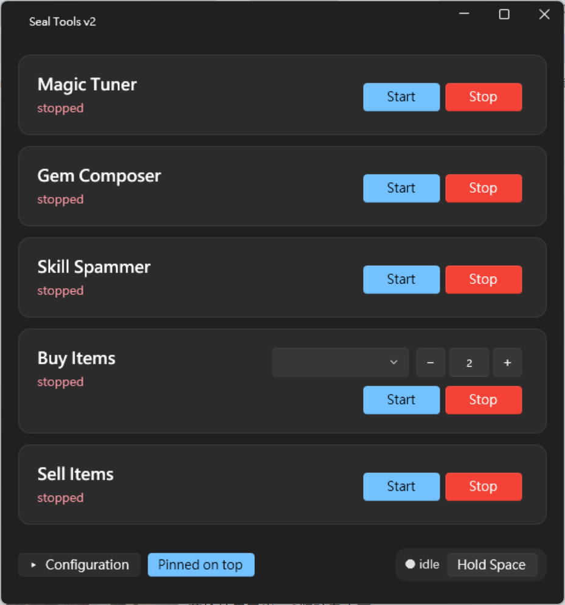
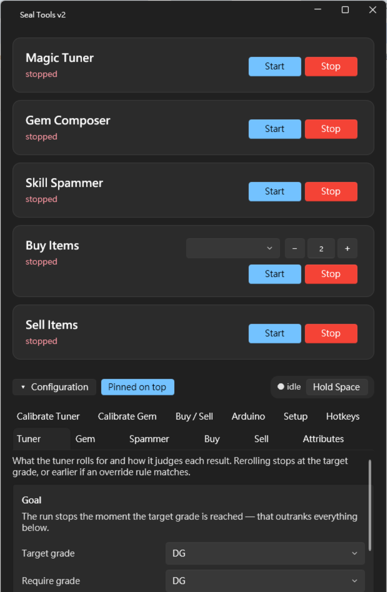

# Seal Tools v2 — 使用指南（繁體中文）

**English version: [USER_GUIDE.md](USER_GUIDE.md)**

啟動器裡每一張卡片、每一個分頁與按鈕的說明，以及什麼時候該用它們。

第一次安裝請先看 [INSTALL.md](INSTALL.md)（目前僅有英文版）。關於座標為什麼這樣運作，請看
[COORDINATES.md](COORDINATES.md)；逐步校正流程請看 [CALIBRATION.md](CALIBRATION.md)；哪個設定放在哪個檔案請看
[CONFIG.md](CONFIG.md)。

> ⚠ **本文件部分章節落後於程式。** 較早的章節對應的是 **v2.9.1** 的內容；目前的版本是 **v2.11**，共有
> **六張卡片、十五個分頁**。`Pet`、`Calibrate Pet`、`Calibrate Tooltip` 三個分頁與 **Pet Feeder** 卡片
> **已經補上中文說明**（見下方 **Pet 分頁**、**Calibrate Pet 分頁**、**Calibrate Tooltip 分頁**）；
> 其餘章節的內容仍然正確，只是文中偶爾還寫著「五張卡片、十二個分頁」，實際畫面上更多。以英文版
> [USER_GUIDE.md](USER_GUIDE.md) 為準。

> 所有工具共用同一個 Arduino COM 埠，所以**同一時間只能跑一個工具** — 例外是 **Pet Feeder**：它是常駐
> 的，啟動其他工具時它會繼續跑自己的排程；如果它的餵食時間到了而遊戲正被其他工具使用，它會等對方用完。

> 介面上的按鈕名稱仍是英文。本文以**英文原名**標示，後面附上中文說明。

---

## 視窗結構

啟動器一開始只顯示工具卡片。設定分頁會收著，等到真的要設定東西時再打開：



*（本頁的兩張截圖來自 **v2.9.1**，當時是五張卡片、十二個分頁；現在是六張卡片、十五個分頁，多了 Pet
Feeder 卡片與 `Pet`、`Calibrate Pet`、`Calibrate Tooltip` 三個分頁。卡片以外的部分沒有改變。）*

每張卡片就是一個工具：名稱、即時狀態，以及 **Start** / **Stop**。Buy Items 是唯一比較高的卡片 —
它的品項與數量位於 Start/Stop **上方**，因為這些必須在執行前決定，而不是執行中。卡片下方左邊是
**▸ Tools** 與 **▸ Configuration**，右邊是 **Hold Space** 與釘選按鈕。

**按 ▸ Tools 可以把卡片收起來**，把視窗讓給其他用途 — 這是為了在小螢幕上校正：六張卡片佔掉的高度，
正是擷取畫布更需要的。它會同時展開設定分頁，因為「收起卡片」只有在你要用分頁時才有意義；而再按一次
**▾ Configuration** 把分頁收起來時，卡片就會回來。視窗永遠不會變成兩者都沒有。
*（這就是這兩個按鈕的搭配：收起卡片會展開分頁，收起分頁會還原卡片。）*

按 **▸ Configuration** 會展開所有分頁，視窗也會跟著長高；再按一次就會收起來，並把視窗還原成展開前的大小。



共有**十五個分頁**，在預設視窗寬度下會**折成兩列**，而且不是照閱讀順序折 — `Tuner` 可能落在**第二列**，
校正與設定類分頁在它上面。折行的方式取決於視窗寬度；固定不變的是分頁的**定義順序**，本文也是照這個順序編排：

`Tuner` · `Gem` · `Spammer` · `Buy` · `Sell` · `Pet` · `Attributes` · `Calibrate Tuner` ·
`Calibrate Gem` · `Buy / Sell` · `Calibrate Pet` · `Calibrate Tooltip` · `Arduino` · `Setup` ·
`Hotkeys`

> 這裡原本有一份兩列折行的實測表，是 **v2.9.1** 當時（十二個分頁）以 619 邏輯像素寬（150% 縮放下為 929
> 實體像素）量出來的，早於 Pet 相關的三個分頁。那份量測已經移除而不是憑空調整 — 猜出來的表格比沒有更糟；
> 如果日後值得再記錄折行方式，請重新量一次。

### 視窗上的控制項

| 控制項 | 功能 |
|---|---|
| **▸ / ▾ Tools** | 收起工具卡片，讓分頁 — 以及擷取畫布 — 取得整個視窗。會同時展開 Configuration；把 Configuration 收起來則會讓卡片回來。不會被記住，下次啟動仍是顯示卡片。 |
| **▸ / ▾ Configuration** | 顯示或收起設定分頁，視窗會跟著調整大小。 |
| **Pin on top** / **Pinned on top** | 讓視窗浮在所有視窗之上，這樣遊戲取得焦點時仍然看得到工具狀態。文字與顏色會跟著狀態改變。 |
| **Hold Space** / **Stop Space** | 按住空白鍵並**保持不放** — 也就是自動撿取，讓你不必自己壓著鍵。再按一次就放開。旁邊的圓點顯示 `● idle` 或 `● holding`。它不是工具卡片，所以不會讓視窗縮小。 |
| `●` 狀態圓點 | 位於 Hold Space 旁邊。按住時為綠色，否則為灰色。 |

**視窗位置會被記住。** 位置、大小與釘選狀態會在移動或縮放停止約 0.7 秒後寫入 `config/local.yaml` —
不是只在正常關閉時才寫，所以用工作管理員強制結束也不會遺失視窗位置。下次啟動會回到你上次放置的地方。

### 工具執行時（迷你模式）

有**前景**工具在跑的時候，視窗只會顯示**那個工具的卡片**（也就是你最後按下 Start 的那一個）。**Pet Feeder
不會觸發這個模式**：它一跑就是好幾天，把視窗收斂到它身上會讓其他一切在整個排程期間都看不到。它的卡片在正常版面下
仍然是即時更新的，所以那裡的「● RUNNING」確實代表它正在餵食：

```
┌─────────────────────────────────────────────────────┐
│  Skill Spammer        [Start] [Stop]                │
│  ● RUNNING · Grade/Cycle …                          │
│                                                     │
│  ▸ Configuration      [Pinned on top]               │
└─────────────────────────────────────────────────────┘
```

*（這是示意圖，不是截圖：要拍下這個狀態就只能啟動工具，而工具會真的在遊戲裡點擊。）*

停止後其他卡片就會回來。搭配 **Pin on top**，就等於一條小巧、永遠可見的狀態列，可以放在螢幕角落、
疊在遊戲上面。Hold Space 是例外 — 它沒有卡片，所以啟動它不會讓視窗縮小。

---

## 工具卡片

| 控制項 | 功能 |
|---|---|
| **Start** | 需要時開啟 Arduino 埠，然後啟動該工具。找不到 Arduino 時會跳出訊息說明原因（請看 **Arduino** 分頁）。 |
| **Stop** | 取消工具、等待它的迴圈結束，並釋放序列埠。 |
| 即時狀態 | 約每 750 毫秒更新一次：`● RUNNING` / `● paused`，接著是 `Grade`、`Remaining`、`Attempt`、`Cycle`、`Current`、符合的屬性列、`Filter:`，以及任何 `⚠` 警告（例如不支援的技能鍵）。 |

按下 Start 後工具就會直接開始運作，沒有額外的「開始」步驟；不過在工具執行中，可以用工具本身的熱鍵
暫停（見 **Hotkeys** 分頁）。

**Pet Feeder 的卡片有兩點不同。** 它是*常駐*的，所以啟動其他工具時它會繼續跑（見上方
[工具執行時（迷你模式）](#工具執行時迷你模式)），而且它的即時狀態是一行**常駐狀態**而不是執行計數 —
`boarding Row 1  ·  next Row 2 at 19:40  ·  2 more queued`，由 **Pet** 分頁上的代養狀態與排程組出來。

### Buy Items 卡片上多出來的控制項

Buy Items 是唯一需要在啟動**之前**做決定的工具，所以它的卡片上就帶了這個選擇 — 你不必為了一個設定
特別打開 Configuration：

| 控制項 | 功能 |
|---|---|
| **品項下拉選單** | 這次要買哪個品項。和 **Buy** 分頁的預設選單是同一個選擇，兩邊會保持同步，因為那本來就是「一個選擇、兩個地方」。 |
| **數量欄位與 `−` / `+`** | 這次要買幾個，初始值取自該品項的 **Usual count**，可以在不改動品項設定的情況下為這次執行調整。`−` 不會低於 1。欄位可自由輸入，無法解析的內容會退回 1，而不是拒絕啟動。 |

---

## Tuner 分頁

Magic Tuner 要洗什麼，以及它怎麼判斷每一次結果。儲存到 `config/defaults.yaml`（可攜設定）。

### Goal

| 控制項 | 說明 |
|---|---|
| **Target grade** | 要洗到的目標等級：`N`、`G`、`DG`、`XG`、`SG`。一旦達到這個等級就會停止 — 它的優先權高於以下所有設定。 |
| **Require grade** | 過濾通過所需的等級下限，`None` 表示不限等級。**Filter enabled** 關閉時此欄位會停用。 |
| **Max retries** | 嘗試次數的安全上限。預設值刻意設得非常大。 |

### Spring (發條)

| 控制項 | 說明 |
|---|---|
| **Spring mode** | `manual` — 你自己把滑鼠移到發條按鈕上，Tuner 只負責點擊與按 Enter。`hid` — 執行開始時由 Tuner 把游標定位到校正過的彈簧點。 |
| **Mouse guard** | 僅 `hid` 模式適用。`off` 完全不看游標。`stop` 在滑鼠偏離按鈕時停止 — 也就是「人類接手了」的情況。`recenter` 會把游標放回去並繼續朝目標等級前進，只有在偏離次數過多時才停止。 |

### Timing

| 控制項 | 說明 |
|---|---|
| **Click delay (s)** | Arduino 點擊之後、按下 Enter 之前的等待時間。 |
| **OCR delay (s)** | 按 Enter 之後、讀取畫面之前的等待時間。太短會讀到上一次的畫面。 |

### Filter — rules (the main goal)

| 控制項 | 說明 |
|---|---|
| **Filter enabled** | 開啟／關閉屬性過濾。關閉時只看等級，以下所有設定都會停用。 |
| **Match mode** | `any` — 符合任一規則即可。`all` — 所有規則都要符合。`per_attr` — 每個規則各自需要達到自己的 **Count** 數量，也就是說 **Count** 只在這個模式下有意義。 |
| 規則清單 | 每個規則一列：屬性名稱、數量、數值上下限，按 `✕` 刪除該列。 |
| **+ Add Rule** | 新增一個空白規則列。 |

### Filter — overrides (stop immediately)

編輯方式與上面相同，但這裡的規則是**覆寫**規則：只要符合其中任一項，不論上面的過濾條件與等級為何，
都會立刻停止。**+ Add Override** 可新增一列。

### Advanced

| 控制項 | 說明 |
|---|---|
| **Save OCR captures** | 每次掃描都把 OCR 畫面存到 `logs/captures/`（僅供除錯）。讀取結果看起來不對時很有用，代價是每一次嘗試都要寫入磁碟。 |
| **Clean up capture images** | 刪除 `logs/captures/*.png`，並在按鈕旁回報刪了幾張。 |

### 儲存

**Save Tuner Config** 會把以上設定全部寫入 `config/defaults.yaml`。結果會顯示在按鈕下方的 InfoBar —
如果寫入失敗，它會明說，而不是假裝儲存成功。

---

## Gem 分頁

Gem Composer 的行為設定。儲存到 `config/defaults.yaml`。

| 控制項 | 說明 |
|---|---|
| **Start grade** | 合成器開始的等級：`N`、`G`、`DG`。 |
| **On empty result** | 合成結果欄位為空時要怎麼做，也就是某個等級的資源用完了。**Stop**（停止）、**Advance to next grade**（前往下一個等級）、或 **Clear resources, then advance**（先對三個資源欄位按右鍵，清除卡住的寶石，再前往下一個等級）。 |
| **Save empty-check captures** | 每個循環都儲存取樣的結果欄位截圖與 `diff=…` 記錄（僅供除錯，每輪都有磁碟 I/O）。空欄偵測的判斷方式見 [CALIBRATION.md](CALIBRATION.md)。 |
| **Save Gem Config** | 把以上設定寫入 `config/defaults.yaml`。 |

點擊座標、結果欄位與移動方式都在 **Calibrate Gem** 分頁，不在這裡。

---

## Spammer 分頁

Skill Spammer 的按鍵輪替設定。儲存到 **`config/local.yaml`** — 這些是個人設定，所以不會進到
`publish.bat` 每次發佈都會附上的 `defaults.yaml`。

Arduino 支援任何單一字母或數字，以及 **F1–F12**。它送不出的按鍵會被略過，並在工具卡片上顯示 `⚠`。

### Active

| 控制項 | 說明 |
|---|---|
| **Preset** 下拉選單 | 目前要使用的具名按鍵組合。清單最後是 **＋ Add new…**，會開啟命名提示。 |
| **Rename** | 開啟命名提示，為目前組合重新命名。**Delete** 會在確認後刪除它 — 最後一個組合無法刪除。 |
| 命名提示 | 只在建立或改名時出現的一列：**Create preset:** 或 **Rename to:**、名稱欄位，然後是 **Create** / **Rename** 與 **Cancel**。名稱重複或空白會被拒絕並顯示訊息，而不是直接覆蓋。 |
| 按鍵摘要 | 目前組合的唯讀磚塊：每個按鍵放在鍵帽裡，下方是它的冷卻時間，`⚡` 表示快速輕點。 |
| **Edit** / **Done** | 展開下方的編輯區，或把它收起來。 |
| 狀態列 | 回報建立、改名或刪除的結果，或說明為什麼被拒絕。 |

### Keys

| 控制項 | 說明 |
|---|---|
| **Key** / **Delay (s)** / **Fast** 表頭 | 每個按鍵一列。`✕` 可移除該列。 |
| **Fast** 勾選框 | 快速輕點：按住約 10 毫秒，而不是一般的 30–80 毫秒。持續性技能請不要勾 — 大多數遊戲要的是較長的按住時間。 |
| **+ Add Key** | 新增一個空白列，冷卻時間預設 0.2 秒。 |

### Advanced

勾選 **Advanced — edit the raw key:seconds list**，就能用純文字編輯同一份資料，適用於列的介面表達不了的設定。
勾選時會把列內容填入文字框；取消勾選時會用你輸入的文字重建列（在那裡 `*` 前綴同樣代表快速輕點）。

### 儲存

**Save Preset** 會把目前組合、其他所有組合，以及目前使用中的組合寫入 `config/local.yaml`。
**切換組合本身不會被儲存**，要按下這個按鈕才會。

---

## Buy 分頁

定義你經常回購的品項，以及 Buy 卡片上 Start 會用到的數字。預設品項儲存在 `config/local.yaml`。

### Item

| 控制項 | 說明 |
|---|---|
| **Preset** 下拉選單 | 要買哪個品項。和 Buy 卡片上的下拉選單是同一個選擇。 |
| **Reload** | 重新從設定檔讀取品項，並重新填入兩個選單。 |

### Position

以下四個欄位描述目前選取的品項。**在你把它們存到某個名稱上之前，編輯它們不會有任何效果。**

| 控制項 | 說明 |
|---|---|
| **Name** | 品項名稱 — 也就是它出現在兩個下拉選單裡的樣子。 |
| **Row** | 該品項位於商店清單的第幾列，顯示為 **Row 1 … Row 10** — Row 1 是最上面一列。實際儲存的是從 0 開始的索引，但標示不是，所以不會有 off-by-one 的問題。 |
| **Scroll notches** | 從**清單頂端**往下滾的滾輪格數。請注意下面的警告 — 只有在清單真的停在頂端時，這個數字才有意義。 |
| **Usual count** | 你通常一次買幾個。Buy 卡片會以此為數量初始值；執行時可以更改，不需要回頭編輯品項。 |
| **Save item** | 把這四個欄位存到該名稱上。名稱不存在就建立，已存在就覆寫。 |
| **Delete item** | 刪除選取的品項。 |
| **Dry run** | 從清單目前的位置往下滾 `Scroll notches` 格，並把游標停在 **Row** 那一列 — **完全不點擊**。這是唯一能設定滾輪格數的方法，因為滾動位置無法在事後量測：看著游標停在哪裡，調整數字直到它落在你要的品項上。 |

> ⚠ **執行前清單必須停在頂端，而這是你的準備工作，不是工具的工作。** 品項的滾動格數意思是「從頂端往下幾格」，
> 所以清單若停在中間，品項就會跟著偏移那麼多 — 而且**沒有任何機制會偵測到**。工具刻意不替你滾到頂端：
> 那會在每一次執行時花掉整份清單的長度。開始前請先看一眼清單。

### Status

回報儲存、刪除或 Dry run 剛剛做了什麼 — 也包含 Dry run 為什麼拒絕執行。

---

## Sell 分頁

要賣掉哪些背包格子。幾何資訊來自校正過的格線與共用的交易流程，所以這裡沒有其他東西要設定。

### Slots to sell

| 控制項 | 說明 |
|---|---|
| **Select all** | 選取全部 64 格。 |
| **Clear** | 取消全部選取。 |
| **Dry run** | 讓游標依**實際執行會使用的順序**走過這些格子，並在狀態列逐步更新。**完全不點擊。** |

### Grid

一個可點擊的 8 × 8 格線，代表你的背包：**第 1 格在左上、第 64 格在右下**，與背包一致，
所以亮起來的格子就等於即將失去的東西。點擊格子可切換選取；滑鼠提示會顯示格號。每一列右邊有一個
**row *N*** 按鈕，可以選取或取消整列的八格 — 一次點擊取代八次，而且不會不小心只選到半列。

> **選取內容永遠不會被儲存。** 每一次都是重新選的，這是刻意的：把上次的選取從存檔還原回來，
> 正是賣錯堆疊的典型原因。

### Safety

| 控制項 | 說明 |
|---|---|
| **Max slots per run** | 單次執行最多能賣幾格，這是**在迴圈中強制執行**的上限，不是建議值。 |
| **Save** | 把上限寫入 `config/local.yaml`。 |

如果你選取的格數超過上限，狀態列會說明，執行也會拒絕 — 請刻意調高上限，或縮小選取範圍。

### 賣出的執行順序

**從編號最大的格子開始賣。** 這樣不論背包在賣掉後是否會自動補位都正確，工具也不需要知道是哪一種 —
如果背包確實會補位，從小的開始賣會無聲地跳過物品。

---

## Pet 分頁

寵物餵食器的**本次執行狀態**：食物放在哪裡、要繁殖哪些寵物。這裡**不是**校正 — 機器本身的幾何設定在
**Calibrate Pet**，兩者刻意分開。格線只量一次；食物在哪裡則隨著角色在做什麼而變，也就是 Sell 分頁已經
寫下的那條規則：沿用上次的選取，就是沒有人重新確認過的選取。

排程與重新裝填實際怎麼運作，請看 [PET-TAB-DESIGN.md](PET-TAB-DESIGN.md)。

### The bag, right now

| 控制項 | 功能 |
|---|---|
| **Page 1 / 2 / 3** | 下方格線正在編輯哪一頁背包。本分頁**會開在你標記實際所在的那一頁** — 以前不論如何都開在第 1 頁，畫面看起像是空的，讀起來就像「我的標記不見了」。 |
| **Mark FOOD cells** | 之後點背包格子，就把該格標為食物格。所有列共用同一個食物池。 |
| **Mark the RETURN slot** | 點格子，標記**代養中的寵物回來的位置** — 一格，保持空的。 |
| **Mark a pet to queue** | 點格子，標記**你想繁殖的寵物**。排隊中的寵物所在的格子**裡面有寵物**，所以和回來的位置不是同一件事。 |
| 64 格選擇器 | 和 Sell 分頁用的是同一個元件，但套用在本畫面的選取上。**點一下是切換** — 再點一次已標記的格子會取消標記。 |
| 格子資訊列 | 游標下的格子目前被標成什麼。 |

背包有變化時就重新標記。標記過期，工具就會對著之後佔用該格的東西按右鍵。三個標記模式是**垂直排列**而
非橫向一排 — 橫向三顆按鈕不會換行，在窄的啟動器上第三顆會直接跑到畫面外。

### Setup so far — this tab

本分頁自己的檢查清單，而且只有它自己的項目。它是 Calibrate Pet 那份清單的對應物 — 那一份講的是**機器**
的狀態，這一份講的是**這一次執行**的狀態。有缺項也可以儲存：工具會說還缺什麼，而不是往空白畫面點下去。

### Ready to run

可執行與否的判定。**Start** 在 Pet Feeder 卡片上，不在這裡。

### Timing

| 控制項 | 功能 |
|---|---|
| **Wait after empty (min)** | 飼料槽空了之後**再過幾分鐘**才重新裝填。刻意取正值：等它空了再裝，才能保證裝進去時它真的是空的，而對不滿的堆疊補料遊戲會怎麼處理並不清楚。代價是有那麼多分鐘沒有進食 — `1`–`2` 足以涵蓋任何漂移。負值會提早重裝並**浪費食物**。 |
| **Action wait (ms)** | 重新裝填**每一個步驟**之後、下一步之前的停頓。太短的話點擊不會生效，代價是整整一個週期。 |
| **Food load** | `Right-click — the game picks the box`（遊戲挑最早的空格；由於所有列共用一個由上而下的佇列，當上面某列已經空了，原本要給下面那列的飼料就會落進上面那列的格子裡），或 `Drag to the row's own box`，後者會指名該列自己的格子，且**需要韌體 2**。這個選項放在這裡而不是寫死在程式裡，就是為了讓還沒重刷的板子仍然能餵食。 |

### Rows and boarding state

| 控制項 | 功能 |
|---|---|
| **RUN**（每列） | 工具**是否要驅動**這一列。取消勾選就完全放著不管 — 仍然已校正、仍然顯示，只是不餵。這就是「少跑幾列但不必刪掉其他列」的做法。關掉的列不會被驗證、讀取、排程或點擊，所以它可以停在只設定一半的狀態，也可以是有人正在手動餵的那一列。 |
| **boarding right now**（每列） | 現在寵物正在代養器裡的列請打勾。重新裝填必須先**結束**代養才能把寵物拿回來、再放進去，而開始／結束是每一列各自的一顆按鈕 — 用錯的狀態去按，會做出與該步驟相反的結果。 |
| **Reload every row when the run starts** | 這是「用看的」看不到的部分的覆寫。寵物格只說代養器裡有寵物，**沒有**說還剩多少食物 — 所以 整夜乾掉的飼料槽，看起來和剛裝滿的一模一樣，就會被放著餓一整個週期。強制重裝不會浪費：結束代養會把剩下的食物連同寵物一起退還。 |

**你不必把這些勾選標對。** 工具啟動時會打開一次繁殖視窗，**看**每一列的寵物格，所以已經在餵的那一列會被
放著不管，而不是被結束再重做一次。這些勾選是「讀不到該列寵物格」時的備援，工具在每次重新裝填後也會自己把它們
更新成最新狀態。

執行期間，卡片上會有一行常駐狀態，就是由這裡的狀態組出來的 — 例如
`boarding Row 1  ·  next Row 2 at 19:40  ·  2 more queued`。它記的是**時間點**而不是倒數，所以卡片會在每次
UI 更新時重算等待時間，而不是顯示一個「寫下的當下才正確」的數字。

### The queue — which pets to breed

| 控制項 | 功能 |
|---|---|
| **Name for the next one** | 你即將拍下的那隻寵物的標籤。 |
| **Which pet line** | 餵食表自己的 `species` — 就是把 `+9 10%` 換算成幾分鐘的那個東西。共十一種選項，不是每隻寵物一個：一條線裡有很多隻寵物，牠們共用同一個數字。 |
| **Capture the marked pet's icon** | 拍下你用 **Mark a pet to queue** 標記的那一格裡的寵物。裁切圖直接取自被標記的格子，所以沒有東西要對準。 |
| **Remove last** | 移除最後一張排隊圖示。 |
| 縮圖 | 實際拍下的圖，而不只是數量 — 它們就是掃描比對用的同一批像素。裁錯的圖什麼都比對不到，安全但無聲，而「一直找不到寵物的執行」和「從來沒填過的佇列」很難分辨。 |
| 佇列清單 | 依標籤列出的排隊寵物。 |

**寵物是靠牠的頭像找到的，不是靠位置。** 回來的寵物會落在**背包第一個空格**，而角色中間都在打怪，所以等它回來時，
原本那一格已經沒有意義。圖示是寵物自己的頭像，會在全部 64 格中比對 — 因此背包可以重新排列，佇列仍然有效。沒有
拍任何圖示時，工具會退回使用回來的位置。

寵物完成後會被**郵寄**離開背包，所以「找得到的排隊寵物」按定義就是還沒完成：工具直接代養第一個比對到的，不需要
其他判斷。同種類的任何一隻都可以無害地替代，因為閒置的繁殖視窗就是浪費時間。

### Find them

| 控制項 | 功能 |
|---|---|
| **Scan the bag for these pets** | 把代養背包打開，然後把上面的裁切圖拿去比對每一頁的全部 64 格。它**不開任何視窗、不點任何東西、也不代養任何寵物** — 只有點 `ITEM` 頁籤，因為寵物可能在任一頁，而沒有別的方法看另一頁。 |

它只回答一個問題：**哪一頁有幾隻哪種寵物**。分數、格子與第二名的候選都在它寫出的檔案裡，和它拍下的各頁放在
一起，而不是顯示在這張卡片上 — 放上來只會把答案埋掉。

### Read a pet's panel

| 控制項 | 功能 |
|---|---|
| **Test read the pet panel** | 游標移到你用 **Mark a pet to queue** 標記的那隻寵物上，並回報 OCR 從懸浮面板讀到什麼。面板需要在 **Calibrate Tooltip** 校正過。 |

寵物**必須真的在那一格** — 已經在代養器裡的寵物會讓那格是空的，讀取就什麼都找不到。把所有數字都倒出來是刻意的：
這樣才能查出面板除了剖析器要的三個值之外還寫了什麼。

### Find the pets that can still be fed

| 控制項 | 功能 |
|---|---|
| **Scan bag for feedable pets** | 掃過**每一頁背包的每一格**，回報每隻寵物的成長值與 EXP，好把 `+9/100%`（已經完成，代養下去會跳錯誤視窗）和還需要餵的 `+0` 分開。唯讀。 |
| **Scan + rebuild the queue** | 同樣掃一遍，然後**用「每一隻還能餵的寵物」的圖示取代整個佇列**。已完成的寵物不會拿到圖示，所以執行時不可能再誤代養到牠們。舊佇列會被丟掉（裡面是已經被郵寄走的寵物的圖示），而如果一張圖示都裁不出來，就什麼都不寫。 |

每格大約 **1.5 秒**，所以一頁大約 **90 秒**：執行時視窗會隱藏，每掃完一頁才帶著該頁結果回來。**背包裡完全不點擊** —
點一下寵物會**切換出戰寵物**，所以這裡只移動游標。兩者都不是的格子就回報為兩者都不是：讀取失敗絕不會被當成
已完成，因為漏掉一隻需要餵的寵物是這裡唯一無法挽回的結果。

會破壞資料的那個掃描是**獨立的一顆按鈕**，而不是旁邊那顆的勾選項，這樣一顆「只是想看看」的掃描就不會悄悄改寫佇列。

### Save

把標記、時間設定與代養狀態寫進 `config/local.yaml`。它叫 **Save** 而不是 *Save Calibration*，因為這個分頁存的是
本次執行的狀態，而不是機器的 — 兩個 Save 各自只管自己那一半。

---

## Attributes 分頁

OCR 屬性字典的唯讀檢視（`config/attributes.yaml`）：**Name**（過濾規則比對用的名稱）、**Category**，
以及會自動修正成該名稱的 **OCR variants** — 也就是 OCR 實際產生的那些亂碼形式。

沒有任何控制項。要新增屬性請直接編輯 `attributes.yaml` 並重新啟動 — 啟動器在啟動時會把它快取起來。

---

## Calibrate Tuner 分頁

把 Tuner 的 OCR 對準遊戲的發條（Magic Tuning）視窗。

| 控制項 | 功能 |
|---|---|
| **Capture 發條 window** | 以實體像素擷取遊戲視窗。**擷取時啟動器會隱藏約 0.3 秒**，避免遮住遊戲 — 這個閃一下是正常的。畫面必須顯示完整的視窗。 |
| 畫布 | 依序拖曳三個框：**等級字母**、**三行屬性**、**彈簧次數**。每個框有顏色區分，太小的拖曳會被拒絕，而不是當成 3 像素的框收下。接著在畫面上**點擊發條按鈕**記錄它的點。 |
| **Check OCR** | 對目前畫面執行完整的「讀取 → 比對 → 過濾」流程。三個框都拖好時會使用它們，否則改用已儲存的校正值並標示出來。輸出包含等級、彈簧次數、三行屬性、`Matched:` 以及 `Filter:` 判定結果。它同時會量測實際的屬性行距並存成 `row_height`。 |
| **Test Click (發條)** | 把游標移到記錄下來的發條點並點擊，讓你能確認它落點正確。只有 **Spring mode** 為 `hid` 時才有意義。 |
| **Save Tuner** | 把區域、子區段、量測到的行高與彈簧點寫入 `config/local.yaml`，記錄顯示環境，並儲存參考截圖 `config/calib_tuner.png`（上面畫有你的框）。 |
| Result | 此分頁的狀態與輸出列 — 擷取結果、OCR 傾印，或儲存確認。 |

---

## Calibrate Gem 分頁

把合成器對準寶石合成介面，測試移動，並儲存它使用哪一組移動方式。

### Capture

| 控制項 | 功能 |
|---|---|
| **Capture gem window** | 同樣以實體像素擷取，擷取時啟動器會隱藏。 |
| 畫布 | 依序點擊：**N**、**G**、**DG**、**Register**、**Combine**，接著點**三個資源欄位**，最後在**合成結果寶石**周圍拖曳一個框。 |

### Coordinates

以數字表示這些點 — 客戶區相對的實體像素，結果區域還可輸入 W/H。直接編輯某個值就能微調一個點
（例如把 N/G/DG 調到同一水平線），不必重新擷取。**Save Coordinates** 會儲存它們。

### Tests

這裡不會寫入設定，本身也不會校正任何東西。

| 控制項 | 功能 |
|---|---|
| **from** / **to** 下拉選單 | 選擇移動測試要用的兩個點。 |
| **Place cursor + click** | 把游標移到 **to** 點**並點擊**。 |
| **Test tuned move** | 點 **from**、送出該路線的原始 `D dx dy`、再點 **to** — 用來確認調校過的移動會落在正確位置。 |
| **Check Result Colour** | 立即取樣結果欄位，回報它的顏色、與空欄參考的距離，以及「空／有寶石」的判定。 |
| **Sample result gem** | 同樣取樣，但附上更多細節（通道差值、主要色調），方便你人工判斷空欄偵測的門檻。 |
| 結果欄位裁切預覽 | 顯示空欄偵測實際取樣的區域，讓你能看出它是否對準了正確的位置。 |

### Move set

| 控制項 | 功能 |
|---|---|
| **Composer move mode** | 合成器要用哪一組移動。`tuned` 會送出調校過的次數；`arduino` 會把游標定位到每條路線的目標點（閉環），而且每次移動都會重新校正，所以不需要調校。按 **Save Gem Composer** 後寫入 `defaults.yaml`。詳見 [MOVE-SETS.md](MOVE-SETS.md)。 |

**非**目前使用中的那一組會變淡到 45% 並停用，避免兩張表混淆。這個選單有自己的一張卡片，
正是為了讓它在任一組使用中時都還能點。

### Moves — tuned (hand-tuned counts)

每條路線一列 — N→Register、G→Register、DG→Register、Register→Combine、Combine→Register、
Register→Resource1、Resource1→Resource2、Resource2→Resource3、Resource3→N/G/DG — 可編輯原始 `dx`/`dy`，
每列有 **Send** 按鈕，會送出該列的確切移動。

| 控制項 | 功能 |
|---|---|
| **Send**（每列） | 執行該條路線：點來源點、送出原始 `D dx dy`、點目標點。 |
| **Save tuned counts** | 把 `gem.movements` 寫入 `config/local.yaml`。這些是手工調校的 HID 次數 — **不是由像素換算而來**，並且只對你的 Arduino、滑鼠速度與遊戲內顯示設定有效。 |

### Moves — arduino (cursor placed on the point)

同樣的路線，每一列顯示**目標點**，並有 **Run** 按鈕：先點來源點，再用 Arduino 把游標定位到目標點並點擊。
這就是合成器在 `arduino` 模式下做的事，所以在這裡測得準，合成器就會準。

### Full-run test

**Run one full cycle** 用 arduino 移動跑一整個合成循環：**N** 選取 → 登錄 → 合成、登出再登錄、再合成一次、
清掉三個資源欄；**G** 同樣；最後 **DG** 合成一次就結束。**這一個會真的在遊戲裡點擊 — 總共 21 次。**
想在把 **Composer move mode** 切成 `arduino` 之前確認新移動方式撐得住一整輪，就按這個。
需要先開著寶石合成視窗並放好資源。

### Advanced

比較兩種游標 API 的輸入測試，以及一個擷取診斷。這些本身都不會校正任何東西。

| 控制項 | 功能 |
|---|---|
| **Diagnose capture** | 回報視窗的框架／客戶區尺寸與非客戶區偏移，並儲存 `logs/captures/diag_capture.png`。用來確認啟動器沒有遮住遊戲。 |
| **Debug Cursor (logical)** | 用 `SetCursorPos` 加上換算後的座標把游標移到選定的點，並顯示計算出的目標、API 是否接受、以及游標最後的位置。**不會點擊。** 僅供診斷 — 工具實際上是靠 Arduino 移動游標，不是這個呼叫。 |
| **Debug Physical** | 同上，但改用 `SetPhysicalCursorPos`。保留它是為了比較兩種 API。 |

### 儲存

**Save Gem Composer** 會把座標點、資源點、結果區域、空欄特徵與 `empty_distance` 寫入 `config/local.yaml`，
並儲存 `calib_gem.png` 與結果欄位截圖。接著它會詢問結果欄位現在是否為**空的**：選 **Yes** 會取樣
空欄偵測所用的「空欄位顏色」參考，選 **No** 則不啟用，而不是把有寶石的畫面當成「空的」記錄下來。

---

## Buy / Sell 分頁

商店工具兩半的校正：Sell 端要點的背包格線，以及 Buy 端使用的商店清單與按鈕。

> **擷取時請讓商店開著、背包開著、數量對話框也顯示著** — 這樣一個畫面就能涵蓋這個分頁上的所有標記。
> 如果某個東西不在擷取畫面裡，請重新擷取後再畫。

### Bag grid

| 控制項 | 功能 |
|---|---|
| **Capture bag window** | 擷取遊戲視窗，擷取時啟動器會隱藏。 |
| **Draw grid area** | 進入拖曳模式：框住**整個 8 × 8 背包**。 |
| **Draw one slot** | 進入拖曳模式：框住**其中一格**。 |
| **Show 64 centres** | 畫出格線推導出的全部格子中心，以及推導出的商店列。 |
| 畫布 | 拖曳的地方。洋紅色圓點是背包格中心，黃色圓點是焦點點，淺藍色框是商店清單區域、其中的綠色圓點是它的列，橘紅色圓點是 MAX。 |

兩個框都需要：整個格線提供間距，而單一格是「格線確實均勻」的驗證。**如果兩者差得太多，
這個分頁會直接說出來，而不是取平均值** — 不一致代表拖曳錯了，不是一個可以折衷的數字。

### Shop (buying)

| 控制項 | 功能 |
|---|---|
| **Draw list region** | 進入拖曳模式：框住**商店清單中恰好可見的那幾列** — 從第一列的頂端到最後一列的底部。推導出的列完全取決於這次拖曳，而這裡有真實的邊界可以對準。 |
| **Mark focus point** | 進入單點模式，下一次在畫面上點擊就會設定這個點。 |
| **Mark MAX button** | 進入單點模式，用來標記數量對話框的 MAX 按鈕。 |
| **Save Calibration** | 把背包格線、單一格框、清單區域、焦點點與 MAX 寫入 `config/local.yaml`。 |

**焦點點必須放在「點了也沒事」的地方。** 它不是純粹的標記 — **兩個工具在每次執行開始時都會左鍵點它。**
啟動工具意味著點擊啟動器，而這會讓遊戲失去焦點；失去焦點之後，遊戲會同時忽略滾輪與右鍵。
一次真實的點擊能把焦點要回來。所以請把它放在空白面板或視窗標題列上 — **絕對不要放在商店列或背包格上**，
在那裡左鍵會選取或買下東西。Buy 也會從這個點開始滾動，這沒有影響，因為滾輪在取得焦點的視窗裡任何位置都有效。

### Setup so far

一份清單，顯示哪些標記已完成（`ok`）、哪些還缺（`--`）：背包格區域、單一背包格、商店清單區域、
焦點點、MAX 按鈕 — 再加上你的購買品項數與販售格數。**有缺漏時仍然可以儲存**：工具會在你按下 Start 時
說明缺少什麼，而不是往空白畫面亂點。

### Test scroll (wheel)

| 控制項 | 功能 |
|---|---|
| **Notches** | 要送出幾個滾輪格數。 |
| **Scroll up**（**Q**）/ **Scroll down**（**Z**） | 透過 Arduino 送出該數量的真實滾輪格數給遊戲，讓你能看出滾一格移動多少 — 這個數字決定了每個購買品項的滾動量。 |

它會先點一下焦點點，因為你剛剛一直在點啟動器，而滾輪需要遊戲取得焦點。單一指令最多攜帶 **400** 格；
這是防止畸形數值卡住板子的保險，而不是你正常使用時會碰到的上限 — 真實的商店清單大約只需要 60 格。

---

## Calibrate Pet 分頁

寵物餵食器中屬於**機器**的那一半：代養視窗的幾何，以及它打開的那個背包。關於**本次執行**的一切 —
食物在哪、要繁殖哪些寵物 — 都在 **Pet** 分頁。

### Capture

| 控制項 | 功能 |
|---|---|
| **Capture game** | 對遊戲視窗截圖。**預期要擷取兩次**，因為標記所在的畫面不可能同時都在：**先**打開圖示面板（點 目錄）並標好那兩個點；**再**打開代養視窗，按一次 Capture。 |

已經放好的標記會**保留** — 每一個都是做好的當下就寫入 — 所以重新擷取只是換掉背景。擷取讀的是螢幕，所以請讓遊戲
保持可見、啟動器不要擋住它。

### How it gets to the feeder

| 控制項 | 功能 |
|---|---|
| **Mark 目錄** | 左下角圖示叢裡的那顆按鈕，會打開一個有八個圓形圖示的面板。 |
| **Mark pet feed icon** | 那個面板裡、拿著奶瓶的小雞圖示。 |
| **Mark boarding X** | 代養視窗的關閉按鈕。 |

前兩個都是**點** — 它們永遠不會移動，所以沒有東西需要尋找。**不要標記主畫面上的寵物圖案**：那會打開手動餵食視窗，
是不同的系統、不同的食物。

### Bag pages

| 控制項 | 功能 |
|---|---|
| **Mark ITEM1 / ITEM2 / ITEM3** | 背包的三個頁籤。 |

它們是**絕對**頁籤 — 點哪一個就到哪一頁，不論你原本在哪一頁。這就是為什麼是三個標記而不是上一頁／下一頁一對：
沒有東西要讀回來，也沒有東西會數錯。

### Breeding rows

| 控制項 | 功能 |
|---|---|
| 列的橫條 | 下方拖曳的一切都會記在這一列上。**先選列。** |
| **+ Add row** | 新增一列，最多四列。 |
| **Food slots in this row** | 免費列是 `2`，付費列是 `5`。 |

視窗裡有**四列 — 一列免費、三列付費擴充** — 而且每一列都有**自己的**開始按鈕、寵物格與食物格。食物格數量是這一列的
**容量**而不是偏好，工具也因此讓每一列跑自己的時鐘：填錯會讓某列提早重裝或放著乾掉。工具**是否要驅動**某一列是執行時
的決定，位於 Pet 分頁的代養勾選區 — 不在這裡，因為這裡決定的是這一列的形狀。

### Row geometry — nudged by typing

每一列的食物橫條，以四個可編輯數字表示像素位置：**x、y、width、height**。改一個，旁邊的格子與裁切範圍就會跟著即時更新。

這個功能存在的理由：擷取圖能回答「框的位置對不對？」，但無法回答「這一列是不是比鄰列偏了一個像素？」— 而那正是
「某一列讀不到、上下兩列卻讀得到」的原因。發生過：某一列的裁切起點比另一列右偏 1–2 個像素，而它最寬的數字
超出了裁切的左緣。**請沿著裁切欄由上往下讀** — 其中的離群值就是那一列的橫條落點不同，微調**它自己的** x 才是有針對性的
修法。改共用的 **Count crop starts at** 數字則會移動每一列，包括本來就讀得到的那幾列。

### Starting boarding

| 控制項 | 功能 |
|---|---|
| **Draw start button** | 框住寫著 開始代養 或 結束代養 的那一顆。食物裝好後，工具會點它的中心。它是同一顆按鈕同時負責開始與結束代養，但**標示不會被讀取** — 排程已經決定什麼時候要重裝，沒有什麼要問的。 |
| **Draw pet slot** | 寵物放下時所在的方格。這是空白檢查的裁切圖，也是在裝任何食物之前回答「寵物到底進去了沒？」的那一個 — 右鍵沒中會留下一個空著的格子，而視窗其餘部分看起來完全正常。 |
| **Draw food strip** | 用**一個**框涵蓋這一列所有的食物格。工具會用該列的食物格數去切分它，所以五格的付費列是一次拖曳，而不是五次、每次都得對齊該列起點的五次拖曳。 |

這條橫條也**就是計數校正的全部**：讀取飼料數量所用的裁切範圍是在每一格內部算出來的，所以沒有別的東西要畫。擷取圖上的
顏色 — **綠色**是開始按鈕、**藍色**是寵物格、**黃色**是由橫條推導出的食物格、**黃綠色**是橫條本身。食物格上有兩個框，
就這樣。

**洋紅色線**是 OCR 開始讀取的位置：它右邊、以格子的完整高度算的範圍就是裁切區。它畫在 **Count crop starts at** 這個
數字指定的位置，所以改那個數字就會移動這條線。它必須避開食物圖示 — 一條穿過圖示的線，會讓讀取什麼都找不到。

### Read the counts

| 控制項 | 功能 |
|---|---|
| **Test read** | 打開代養視窗、**格子裡要有食物**，然後按這個。它會讀取每一個勾選要執行的列，使用該列自己的格子，並回報讀取器對每一格的理解 — 包括空的格子，那對沒有食物的格子而言才是正確答案。 |
| **Count crop starts at** | 從每一格的哪個位置開始讀，以格子寬度的比例表示。**整個讀取就取決於這一個數字。** `0.40` 是量測出來的位置，而能正常工作的區間只有幾個像素寬。 |
| **Min score** | 讀取器必須有多確定。真實的計數得分在 **0.90–1.00**；食物圖示產生的一切最多只得到 **0.63**。 |

如果數字讀回來是**被截斷的**（第一個數字不見了），代表線太靠右；如果**什麼都沒讀到**，可能是太靠左、進到了食物圖示裡。
結果會顯示在按鈕下方自己的面板裡，而不是共用的提示列 — 因為要去找才看得到的結果，就是沒有人會去確認的結果。

### Bag grid (this flow's own)

| 控制項 | 功能 |
|---|---|
| **Draw grid area** | 框住整個 8 × 8。 |
| **Draw one slot** | 再框住其中一格，作為均勻性檢查。 |
| **Show 64 centres** | 畫出工具實際上會按右鍵的位置。如果點沒落在格子上，就重新拖曳格線區域。 |

**代養視窗打開的背包，和商店旁邊打開的那個背包位置不同**，所以這是它自己的校正 — Buy/Sell 的數字**不會**被沿用。
共用的話，每一次點擊都會瞄準錯誤的物品。

### Setup so far

隨著你標記而填入。有缺項也可以儲存 — 工具會說還缺什麼，而不是往空白畫面點下去。

### The empty-slot reference

這是工具拿每一列的寵物格去比對的參考圖，對應上方選取的那一列，並以預覽圖顯示。它應該顯示該列的**空**格子：如果顯示的是
寵物、較舊的視窗版面，或什麼都沒有，請重新擷取。這張圖決定了工具是否認為某列正在代養，而那又決定了它要不要按該列的
切換鈕 — 有一次實機執行就是因為三列空著的列被讀成「已佔用」（比對到並非大家以為的那份參考圖）而出錯。

### Save

| 控制項 | 功能 |
|---|---|
| **Capture empty pet slot** | 在繁殖視窗**開著、裡面沒有寵物**時擷取。這是工具在每次放置之後比對的參考，它才能分辨「寵物真的進去了」和「右鍵什麼都沒做」。**沒有這張圖，檢查就會被跳過，而失敗的放置完全看不出來** — 有一次 12 小時的執行就是這樣損失了一半的代養時間，卻回報成功。 |
| **Save Calibration** | 把幾何設定寫入 `config/local.yaml`。 |

---

## Calibrate Tooltip 分頁

量測**懸浮面板** — 也就是餵食器在代養前，用來讀取寵物成長值與 EXP% 的那個框。只有寵物餵食器會用到；其他工具不需要。

### Measure the hover panel

| 控制項 | 功能 |
|---|---|
| **Capture game** | 打開背包，或任何裝著該物品的視窗。 |
| **Mark hover point** | 在擷取圖上點你要看面板的那個物品。工具會把游標停在那裡 — 所以要挑一個一定會顯示面板的。 |
| **Hover and capture** | 工具會用 Arduino 把游標移過去、點一下讓遊戲取得焦點、等待面板出現，然後再擷取一次。接著**拖一個框把面板框起來**。 |

位移量是由工具實際放置游標的那個點算出來的，所以**不需要輸入任何數字，也不是用眼睛估的**。框請以**你會在意的最大面板**
為準 — 寵物的面板比食物物品的大 — 因為較小的面板只會在它後面留下背景，而讀取會忽略背景。為每種物品各做一個框雖然更貼合，
卻會讓位移量不再通用，而那正是這個機制的重點。

### Save and check

| 控制項 | 功能 |
|---|---|
| **Hover delay (ms)** | 游標停在物品上多久之後才讀取面板。 |
| **Save Calibration** | 把位移量與延遲寫入 `config/local.yaml`。 |
| **Test read** | 執行懸浮與讀取，並回報 OCR 從面板讀到了什麼。 |

延遲是一個欄位而不是常數，因為 `700` 毫秒是量出來的、而且馬上就發現不夠：有一次讀取抓到的是還壓著游標、面板還沒出現的
背包，**而那看起來和「位移量錯了」一模一樣**。請調高到 **Test read** 穩定為止，然後按 Save 保存。

---

## Arduino 分頁

連線診斷，分成你真正會問的兩件事：*Arduino 在不在*，以及*它的點擊到不到得了遊戲*。

### Connection

| 控制項 | 功能 |
|---|---|
| 狀態燈號 | 當作業系統上出現符合設定 VID/PID 的序列裝置時顯示綠色，否則紅色。 |
| 埠清單 | 列出作業系統看到的所有序列埠，符合的以 `>>` 標示，並顯示預期的 VID/PID 與每個裝置的 PnP id。 |
| **Refresh** | 重新掃描。它不會自動更新。 |

### Input test

**Send a test click** 會開啟埠，並在**游標目前所在的位置**送出一次 Arduino 左鍵 — 這是 HID 路徑確實可用的
端到端證明。它**不會**移動游標；要連游標一起定位請用 Calibrate Gem → **Place cursor + click**。
結果顯示在按鈕旁邊，不會蓋掉上面的連線狀態。

---

## Setup 分頁

記錄校正時的顯示環境。

| 控制項 | 功能 |
|---|---|
| **Detect** | 量測目前的遊戲視窗：螢幕實體尺寸、DPI 與縮放比例，以及視窗的框架／客戶區尺寸。並填入下方欄位。 |
| **Scale** | 每個邏輯像素對應的實體像素數（例如 1.5）。會自動偵測；偵測錯誤時可手動修改。 |
| **Reference client size** | 此校正所對應的遊戲客戶區尺寸（實體像素）。 |
| **Save Setup** | 把 `calibration:` 區塊寫入 `config/local.yaml`。 |
| 已儲存校正 | 顯示已儲存的縮放比例、客戶區尺寸與時間 — 或「尚無」。 |
| ⚠ 警告 | 當目前客戶區尺寸與已儲存的不同時出現。**請重新校正 — 不要沿用舊座標。** |

想知道某份既有的校正還適不適用，就看這個分頁，這是面對一台還沒校正過的機器時第一個該檢查的地方。

---

## Hotkeys 分頁

執行中工具的全域熱鍵。

| 控制項 | 說明 |
|---|---|
| **Start / stop rolling** | 切換目前工具是否執行。預設 `F12`。 |
| **Quit (immediate)** | 立即停止工具。預設 `F11`。 |
| **Advance grade (gem)** | 讓合成器前往下一個等級。預設 `G`。 |
| **Pause (graceful stop)** | 完成目前循環後停止。預設 `CapsLock`。 |
| **Save Hotkeys** | 寫入 `config/defaults.yaml`。名稱無效會被拒絕並顯示訊息，而不是照樣儲存。 |

輸入名稱：`F1`–`F24`、`Esc`、`CapsLock`、`Space`、`Tab`、`Enter`，或單一字母／數字。

> **只有啟動器取得焦點時熱鍵才會作用。** 遊戲的反外掛會阻擋背景的按鍵讀取，所以當你在遊戲中時，
> 這些鍵完全不會有反應。請先點一下啟動器，再按熱鍵 — 或直接按卡片上的 **Stop**。

---

## 常見流程

**第一次在新機器上使用**

1. 依 [INSTALL.md](INSTALL.md) 安裝（燒錄板子、解壓縮、以系統管理員身分執行）。
2. **Setup** → **Detect** → 確認縮放比例／客戶區尺寸 → **Save Setup**。
3. **Calibrate Tuner** → **Capture 發條 window** → 拖曳三個框 → **Check OCR**（必須讀到正確的等級、
   彈簧次數與三行屬性）→ **Save Tuner**。
4. **Calibrate Gem** → **Capture gem window** → 點擊各點並拖曳結果框 → **Save Gem Composer** →
   用 **Send** 測一條調校路線，或用 **Run** 測一條 arduino 路線。
5. **Buy / Sell** → **Capture bag window** → 拖曳格線區域與單一格 → **Show 64 centres** 確認圓點落在
   格子上 → 拖曳清單區域 → 標記焦點點與 MAX → **Save Calibration**。
6. **Arduino** → **Refresh** → **Send a test click**。

**驗證既有的校正**（不需重新擷取）

- **Calibrate Tuner** → 直接按 **Check OCR**：它會用已儲存的幾何設定，並顯示屬性比對與過濾結果。
- **Calibrate Gem** → 用 **Place cursor + click** 測一個點；用 **Check Result Colour** 測空欄偵測。
- **Buy / Sell** → **Show 64 centres**，看看圓點落在哪裡。

**新增一個購買品項**

1. 打開商店，把清單**滾到頂端**，並打開背包。
2. **Buy** 分頁 → 輸入 **Name**、選擇 **Row**、滾動量先留 0 → **Save item**。
3. **Dry run** → 看游標停在哪裡。如果不在你要的品項上，調高 **Scroll notches** 再試一次，
   直到落在正確位置，然後 **Save item**。
4. 在 Buy 卡片上設定數量，按 **Start**。

**一次販售**

1. 打開背包。
2. **Sell** 分頁 → 點選要賣的格子（或用 **row *N*** 選整列）。
3. **Dry run**，看著游標依順序走過它們。
4. 把 **Max slots per run** 設成你放心的數字。
5. 按 Sell 卡片的 **Start**。它會先點焦點點，再從編號最大的格子開始賣。

**實際執行**

- 在卡片上按 **Start**。要停止時按 **Stop**，或先點一下啟動器再按 `F11`／`CapsLock`。

---

## 疑難排解

| 症狀 | 可能原因／處理方式 |
|---|---|
| 按 Start 沒反應，跳出「Arduino not found」 | 埠號／VID／PID 設定錯誤，或裝置沒插好、用到只能充電的線 — 請看 **Arduino** 分頁。 |
| 工具啟動後完全沒動作，但游標有移動 | 遊戲沒有取得焦點，或某個座標錯了。這兩者看起來一模一樣，因為交易流程是射後不理 — 沒有任何回報。先看 **Arduino** 燈號，再用 **Dry run**。 |
| 擷取到啟動器，或畫面有一塊黑 | 遊戲必須是可見的；把啟動器移開，並用 **Diagnose capture** 檢查。 |
| Check OCR 讀到錯誤的文字 | 發條視窗移動了，或被其他遊戲內視窗遮住。請重新擷取並重新拖曳。 |
| Buy 的 Dry run 停在錯的品項上 | 執行前商店清單不在頂端，或滾動格數不對。先把清單滾到頂端，再調整 **Scroll notches**。 |
| Buy 點了某一列卻沒反應 | 清單滾動過了，所以那一列不在品項設定的位置。沒有任何機制會偵測到 — 請確認清單在頂端。 |
| Sell 賣掉了錯的堆疊 | **立刻停止。** 可能是選取內容過期或錯誤，或背包格線有問題 — 到 **Buy / Sell** 按 **Show 64 centres**，確認圓點落在格子上。 |
| 焦點點在遊戲裡點到了東西 | 它被標在會作用的控制項上了。請重新標在「點了也沒事」的地方 — 那一點在每次執行開始時都會被真的左鍵點擊。 |
| 合成器點擊會偏移 | 開啟了「增強指標精確度」，或 Arduino／滑鼠速度改變。先修正設定，再用 **Send** 重新調校次數。或者把 **Composer move mode** 切成 `arduino`，它每次移動都會重新校正。 |
| 換螢幕或改解析度後全部偏移 | 這是預期行為。打開 **Setup**：若縮放比例或客戶區尺寸不同，請重新校正。 |
| Spammer 完全沒按鍵 | 該按鍵不是單一字母／數字或 F1–F12 — 卡片會顯示 `⚠`。 |
| 遊戲中熱鍵沒反應 | 這是預期行為：請先讓啟動器取得焦點（見 Hotkeys 分頁）。 |
| 空欄偵測一直不推進等級 | 儲存的空欄參考可能是在欄位裡有寶石時取樣的。請在欄位為空時重新儲存。詳見 [CALIBRATION.md](CALIBRATION.md)。 |
